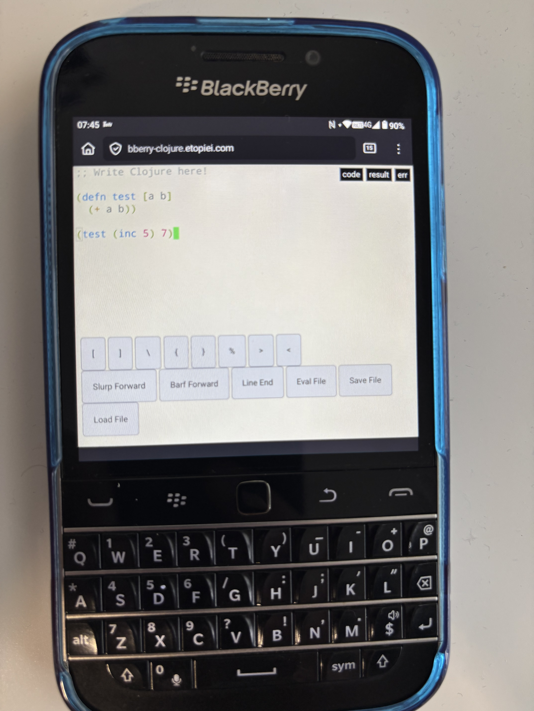

# BBerry Clojure

[Try it out: bberry-clojure.etopiei.com](https://bberry-clojure.etopiei.com/)

I recently changed phones to a Zinwa Q25 (a modified Blackberry Q20) and really enjoy the keyboard.

Therefore I thought it would be great to be able to code on the go with it!

This project is an attempt to bring a minimal Clojure editor to my phone as I couldn't find any apps that quite suited the lack of special characters but the presence of a physical keyboard.

## In Action

## Thanks

I did very little actual work for this project. The majority of this is a modification of the paredit.js example page. So thanks to the folllwing projects that made this possible:

 - [paredit.js](https://github.com/rksm/paredit.js) (specifically [this demo page](https://github.com/rksm/paredit.js/blob/master/examples/paredit.html))
 - [Ace editor](https://github.com/ajaxorg/ace/) (for a great in browser editor)
 - [scittle](https://github.com/babashka/scittle) (for executing Clojure on-device within html)

The name of this app was going to be 'BB Clojure' but 'bb' is already a fantastic app in the Clojure community! So I thought it was a nice nod to borkdude to call it 'BBerry'.

## Usage

This is quite specific to my use case, but if you do want to use this you can, and it's not too bad an experience from computer either.
All dependencies are vendored into this repo, so you can run this all by opening `index.html` in your browser and everything should load in.

In fact, it makes a pretty decent portable Clojure environment in ~1.5mb (though no REPL 😢)
Chuck it on a USB and you're always good to go!

## Todos/Ideas

 - Fix bug inserting opening bracket/brace not creating matching pair
 - Notify when there is output/error
 - Inline the output somehow
 - Add ability to eval form before point
 - Improve style of output/error
 - Dark mode support
